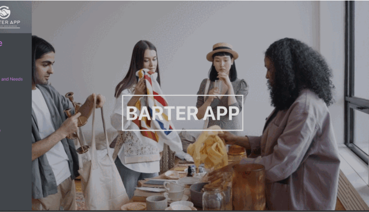

# BarterApplication

Full Stack Application to enable users to trade goods and services among each other

Tech Stack:

NodeJS 
ReactJS & React-Bootstrap
ExpressJs
Redux Toolkit 
MongoDB atlas (database)
Cloudinary (image hosting)
Firebase Authentication)
MUI and Sass (for styling)
Firebase Chat
React Charts

